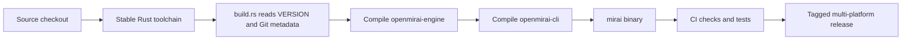
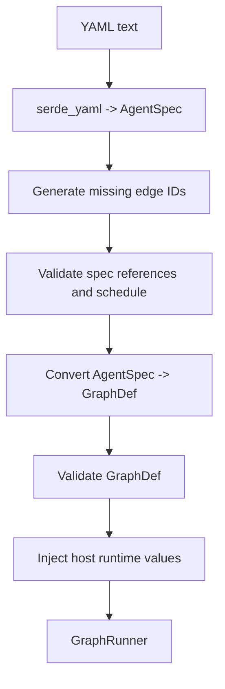
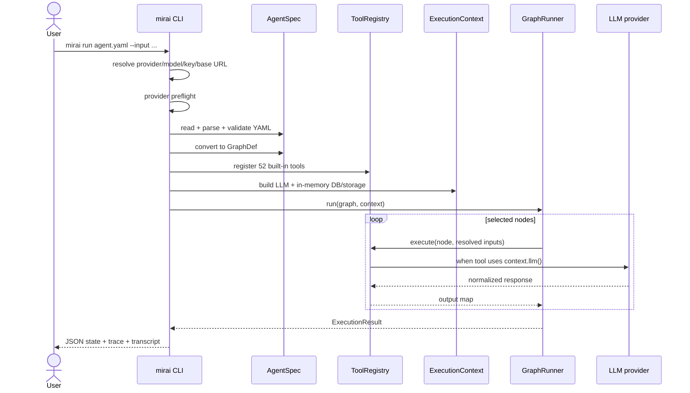
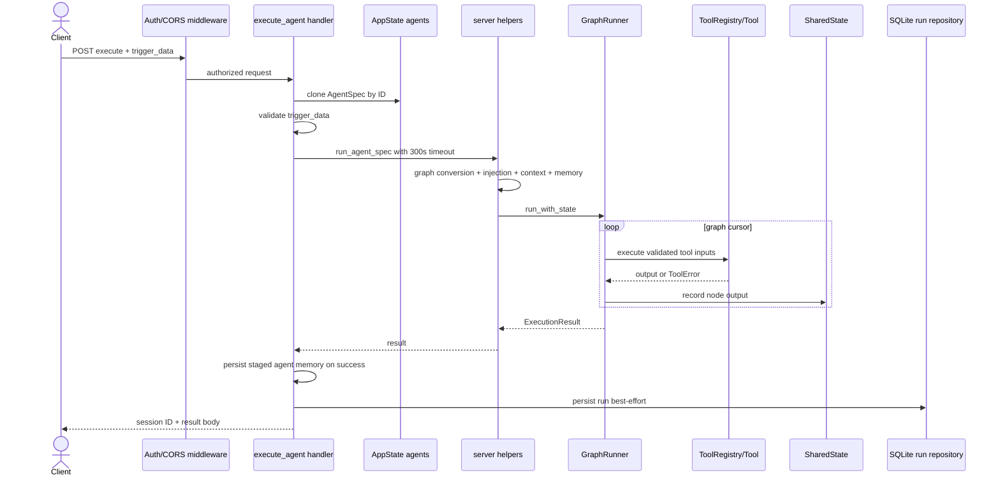

# OpenMirai System Architecture and Execution Lifecycle

This document is the end-to-end map of OpenMirai 0.7.0. It explains how the
repository is built, which components participate in a real CLI or HTTP run,
how data moves between them, what is persisted, and how a process shuts down.

Use this document when you need to answer four questions:

1. What are the parts of OpenMirai?
2. Which parts are actually wired into the executable?
3. What happens from an agent YAML file or HTTP request to a final result?
4. Which boundaries matter before packaging the engine in a container?

For field-level API and tool details, follow the links in the final section.
For the Docker and cloud implications of this lifecycle, see
[Cloud Deployment Readiness](infra/CLOUD-DEPLOYMENT.md).

## 1. The shortest accurate mental model

OpenMirai is a host around a graph runner:

```text
Agent YAML / HTTP AgentSpec
          |
          v
parse + validate + convert to GraphDef
          |
          v
GraphRunner -----> RegistryExecutor -----> ToolRegistry -----> Tool
    |                                                        |
    |                                                        v
    +---------------- SharedState <-------------- ExecutionContext
                                                  |   |   |   |
                                                  DB LLM Store Vector
                                                       |
                                                       v
                                          provider-specific LLM adapter
```

The graph controls **which tool runs next**. The execution state carries
**what previous tools produced**. The execution context provides **which
external capabilities a tool is allowed to use**. The host—CLI, HTTP server,
or an embedding application—decides how those pieces are wired.

That last sentence is essential: the engine crate contains more primitives
than the current `mirai` CLI and server activate.

## 2. Implementation status vocabulary

This document labels components with one of these states:

| Status | Meaning |
|---|---|
| **Wired** | Used by the current CLI or HTTP server production path. |
| **Library-only** | Implemented and tested, but the current CLI/server does not attach it. An embedding host can use it. |
| **Partial** | Some paths use it, or the public shape exists but important behavior is missing. |
| **Placeholder** | The type/tool/API exists primarily as a contract for future host-side work. |

Do not infer production behavior from a public type alone. Check the status
and the host wiring.

## 3. Repository and build architecture

### 3.1 Cargo workspace

The root `Cargo.toml` defines a two-member workspace:

| Crate | Artifact | Responsibility |
|---|---|---|
| `engine/` | `openmirai-engine` library | Specs, graph runner, tools, resources, providers, server, persistence, scheduler, and supporting subsystems. |
| `cli/` | `mirai` binary | Command parsing, provider selection, context construction, direct execution, HTTP server startup, editor startup, and operator-facing commands. |

The engine requires Rust 1.80 or newer. `rust-toolchain.toml` pins the stable
toolchain and requests `rustfmt` and `clippy`.

### 3.2 Features

The engine's default features are:

- `server`: Axum HTTP API, CORS/auth middleware, and SSE support.
- `builtin-tools`: all registered tool families.

The CLI depends on the engine with its default features, so a normal
`cargo build --release --bin mirai` produces one binary containing both the
direct CLI runner and the HTTP server.

### 3.3 Compile-time metadata

Both crates run a `build.rs` script. The scripts inject:

- `MIRAI_VERSION` from the repository `VERSION` file;
- `MIRAI_BUILD` from `MIRAI_BUILD_NUMBER`, or `dev` locally;
- `MIRAI_GIT_SHA` from `git rev-parse`, or `unknown`;
- `MIRAI_BUILD_TS` from the build environment, or `unknown` locally.

The CLI `version` command and the server `/health` and `/version` endpoints
report these compiled values. The build scripts warn when a crate version and
the `VERSION` file disagree.

### 3.4 Build and release lifecycle



CI separately checks formatting, Clippy, workspace tests, CLI integration,
HTTP end-to-end behavior, and SDK compatibility. The release workflow builds
native binaries for macOS, Linux, and Windows and publishes checksums. There is
currently no repository-owned Docker image or Docker release job.

## 4. Component map

| Component | Main source | Status in CLI/server | Responsibility |
|---|---|---|---|
| CLI dispatcher | `cli/src/main.rs` | **Wired** | Selects `run`, `serve`, `edit`, validation, model, tool, RAG, eval, and session commands. |
| Provider factory | `cli/src/adapter_factory.rs` | **Wired** | Resolves provider implementations, base URLs, and provider credentials. |
| Agent specification | `engine/src/core/agent_spec.rs` | **Wired** | Parses YAML, validates the declarative contract, and converts it to `GraphDef`. |
| Graph model | `engine/src/core/graph.rs` | **Wired** | Defines nodes, edges, conditions, mappings, entry-node discovery, and structural checks. |
| Graph runner | `engine/src/core/runner/graph_runner.rs` | **Wired** | Traverses the graph, executes tools, routes branches, retries, records state/trace/transcript, and emits optional events. |
| Execution state | `engine/src/core/state.rs` | **Wired** | Thread-safe map of `node_id -> output fields` for one run. |
| Tool registry/executor | `engine/src/tools/registry.rs` | **Wired** | Maps `tool_type` to a factory, validates inputs/config, catches tool panics, and calls the tool. |
| Built-in tools | `engine/src/tools/builtin/` | **Wired** | Implements the graph's side effects and transformations. |
| Resource ports | `engine/src/core/context.rs` | **Wired** | Defines DB, LLM, storage, vector, auth, session, prompt, and scratch interfaces. |
| Default context | `engine/src/adapters/context.rs` | **Wired** | Holds concrete resource implementations behind port traits. |
| LLM adapter layer | `engine/src/llm/` | **Wired** | Converts normalized requests into provider-specific HTTP protocols. |
| LLM bridge | `engine/src/adapters/adapter_bridge.rs` | **Wired** | Adapts `LLMAdapter` to the simpler `LLMResource` interface used by tools. |
| HTTP server | `engine/src/server/` | **Wired** | Owns Axum routes, middleware, application state, request execution, SSE, and run persistence. |
| Run repository | `engine/src/db/sqlite.rs` | **Wired in server** | Persists completed/interrupted/failed execution results in SQLite. |
| Agent KV memory | `engine/src/runtime/agent_memory_store.rs` | **Partial** | Carries declared agent memory between runs/cycles, but only in process memory. |
| Live scheduler | `engine/src/runtime/scheduler.rs` | **Partial** | Implements recurring Tokio tasks. The current `serve()` path creates it but does not call `Scheduler::start()`. |
| Generic event emitter | `engine/src/core/events.rs` | **Library-only for graph runs** | Broadcast event channel attachable to a runner; the CLI/server runner is not built with it. |
| Checkpoint callback and resume | `engine/src/core/runner/` | **Library-only** | Runner can save checkpoints and resume at a node if a host supplies storage and an API. |
| Real-time run SSE | `engine/src/streaming.rs` | **Partial** | HTTP streaming emits graph/node start/completion events. Token and fan-out variants exist but the current runner does not emit them. |
| AgentRuntime | `engine/src/runtime/agent_runtime.rs` | **Placeholder/alternative host** | In-memory registration API; its `execute_agent()` simulates completion instead of invoking `GraphRunner`. The server uses its own `AppState` path. |
| Nested agent tool | `engine/src/tools/builtin/agent.rs` | **Placeholder** | Enforces depth/cycle guards and returns host instructions; it does not execute a child graph itself. |
| Webhook endpoint | `engine/src/server/handlers.rs` | **Placeholder** | Acknowledges the webhook body but does not route it to matching agents. |
| Orchestrated sessions | `engine/src/sessions/`, `engine/src/server/orchestrator.rs` | **Wired on Unix with dependencies** | Manages external Claude Code processes in tmux. This is separate from YAML graph execution. |
| RAG, eval, universe, intelligence, energy, vault, render, benchmark, catalog | dedicated engine modules | **Mixed** | Supporting subsystems with different degrees of integration; see [Advanced Subsystems](backend/ADVANCED_SUBSYSTEMS.md), [RAG](backend/RAG.md), [Storage](database/STORAGE.md), and [Observability](backend/OBSERVABILITY.md). |

## 5. The four kinds of data

Keeping these data classes separate makes the lifecycle easier to reason about.

### 5.1 Definition data

`AgentSpec` is the source definition. It contains identity, optional input and
output declarations, nodes, edges, triggers, memory declarations, schedules,
provider-independent config, MCP server definitions, and metadata.

The canonical on-disk format is YAML. `AgentSpec::from_file()` rejects JSON.

### 5.2 Control-flow data

`GraphDef` contains:

- `NodeDef`: a stable node ID, `tool_type`, version, config, and optional editor position;
- `EdgeDef`: source, target, optional condition, and optional `data_map`;
- graph ID/name/version and metadata.

Edges determine the next node. Conditions inspect the output of the node that
just completed. `data_map` determines which previous state values become named
inputs for a target node.

### 5.3 Runtime data

`SharedState` is an `Arc<RwLock<...>>` around:

```text
node_id -> { output_field -> JSON value }
```

It lives for one graph execution. Every successful node writes its output
under its node ID. Later edges can reference those values.

`ExecutionResult` returns:

- final status;
- state snapshot;
- machine-oriented trace entries;
- human-oriented transcript entries;
- optional error or interrupt information.

### 5.4 Operational data

Operational state belongs to the host rather than the graph:

- registered agents and graphs;
- completed run/session records;
- live-agent memory and scheduler state;
- orchestrated tmux session registry;
- provider secrets and model selection;
- static UI and project directories.

Each item has a different durability boundary. See section 13.

## 6. Agent definition lifecycle



### 6.1 Validation that actually occurs

Parsing and validation reject:

- invalid YAML or non-YAML file extensions;
- duplicate node or edge IDs;
- edges pointing to missing nodes;
- an empty graph;
- unconditional self-loops;
- invalid managed/live schedule combinations;
- cron schedules, which are declared but not implemented.

The validator does **not** prove that the graph is acyclic. Conditional
self-loops and longer cycles can pass structural validation. The runner's
per-node visit limit is the runtime loop guard.

The validator also does not reject disconnected or orphaned components.
`GraphRunner` selects the first entry node and only executes nodes reachable
from that entry.

### 6.2 Runtime injection

Before running, the host may mutate the converted graph:

- trigger input becomes `payload` in the first `trigger/*` node;
- the CLI inserts its selected model into `ai/llm_call` nodes that have no model;
- MCP server definitions become the internal `__mcp_servers` config;
- server memory declarations become `__memory_spec` and `__agent_id` on `state/memory` nodes;
- a SOUL file becomes the execution context's system prompt, falling back to the spec prompt if loading fails.

These are host responsibilities, not operations performed by `GraphRunner`.

## 7. CLI `mirai run` lifecycle

The direct CLI path is synchronous from the user's point of view.



Detailed order:

1. Parse command flags.
2. Resolve provider and model.
3. Run provider preflight. Ollama readiness/model availability or cloud key availability can abort before parsing the agent.
4. Load and validate the YAML `AgentSpec`.
5. Reject a `live` agent on the direct `run` command.
6. Convert the spec to `GraphDef`, generate edge IDs, and validate again.
7. Register every built-in tool.
8. Build `RegistryExecutor` and `GraphRunner`.
9. Resolve SOUL/system prompt.
10. Build a per-run `DefaultExecutionContext` with the selected LLM, `InMemoryDBResource`, and `InMemoryStorageResource`.
11. Validate optional CLI input against the agent input declaration and inject trigger payload.
12. Inject the selected model and MCP config.
13. Execute the graph.
14. Optionally render trace and benchmark data.
15. Print the serialized result. Exit non-zero unless status is `Completed`.

The direct CLI path does not persist graph runs to the server SQLite database.
Its DB and storage resources are recreated in memory for each command.

## 8. HTTP server process lifecycle

### 8.1 Boot

`mirai serve` performs these steps:

1. Resolve host, port, provider, model, provider credentials, server API key, UI path, project roots, and database path.
2. Create an LLM factory. Each graph execution asks the factory for a fresh `LLMResource` wrapper.
3. Refuse a non-loopback bind when no server API key is configured.
4. Register all built-in tools.
5. Construct `AppState`, including in-memory graph/agent/session maps, runner, agent-memory store, scheduler, and tmux session manager.
6. Resolve the run database path: `--db-path`, then `MIRAI_DB_PATH`, then `~/.openmirai/engine.db`.
7. Open SQLite, enable WAL/busy timeout/foreign keys, and run schema migrations. If this fails, the server logs a warning and continues with memory-only run history.
8. Load and reconcile the tmux orchestrator JSON registry, then start its polling task.
9. Build the Axum router and middleware.
10. Bind the TCP listener and serve until SIGINT or SIGTERM.

### 8.2 Middleware order and trust boundary

The router applies:

- API-key authentication when configured;
- a cross-origin guard for mutating browser requests;
- restricted CORS handling;
- public `/health`, `/version`, and static `/ui` content.

The server speaks plain HTTP. Rustls is used by outbound provider HTTP clients;
it does not make the Axum listener an HTTPS server. A cloud deployment must
terminate TLS at an ingress, reverse proxy, or managed load balancer.

### 8.3 Graceful shutdown

Axum receives a shutdown future that waits for Ctrl-C or SIGTERM. Once fired,
the server stops accepting new connections and lets Axum finish in-flight
requests before returning. The code does not currently perform a separate
explicit drain/flush protocol for the live scheduler or tmux orchestrator.

## 9. Synchronous HTTP execution lifecycle

The main production request path is:

```text
POST /api/v1/agents/{id}/execute
```



Detailed behavior:

1. Middleware authenticates the request when `MIRAI_API_KEY` is set.
2. The handler looks up an `AgentSpec` in the in-memory agent map.
3. It validates `trigger_data` and applies declared defaults.
4. It rejects live agents, which must use `play`/`stop`.
5. It wraps execution in the server-wide 300-second timeout.
6. The helper builds and validates the graph, applies trigger/MCP/memory/prompt injections, creates the execution context, and seeds the state with agent memory.
7. `GraphRunner` executes the graph.
8. On success, staged `state/memory` writes are copied into the process-local agent-memory store.
9. The handler allocates an HTTP session ID and builds the response.
10. `AppState::record_session()` writes the result to SQLite when available and then inserts it into the in-memory hot cache. Persistence failure is logged but does not fail the client request.

Important details:

- `ExecuteRequest.entry_node_id` is currently accepted by the request type but ignored. The runner chooses the first entry node.
- The handler returns HTTP 504 when the 300-second wrapper expires. The timed-out run is not recorded as a completed session by this handler.
- The server builds in-memory DB and storage resources for each graph run. The run-history SQLite repository is a separate host concern; it is not the `DBResource` exposed to agent data tools.
- `AgentConfig.timeout_ms`, `AgentConfig.max_iterations`, top-level retry config, and hook declarations are not currently applied by the CLI/server construction path. The runner therefore uses its own defaults unless a host embeds and configures it directly.

## 10. GraphRunner inner lifecycle

### 10.1 Start

`GraphRunner::run_with_state()`:

1. validates `GraphDef`;
2. obtains all nodes with no incoming edges;
3. chooses the first entry node;
4. enters `run_from()` with a cursor, state, trace, transcript, visit counts, and step count;
5. emits optional start events and invokes an optional graph-start hook.

### 10.2 Per-node loop

For every cursor node:

1. Check an externally requested pause. If present, save a checkpoint when a callback exists and return `Interrupted`.
2. Increment the node's visit count. More than the runner limit returns `MaxIterationsExceeded`.
3. If the node is `logic/human_input`, save an optional checkpoint and return `Interrupted` with prompt/options metadata before executing the tool.
4. Resolve inputs from incoming-edge `data_map` expressions.
5. Merge node config values only for keys not supplied by resolved inputs.
6. Invoke the optional `pre_block_exec` hook. It may continue, abort, skip, or replace inputs.
7. Emit node-start records/events.
8. Invoke the optional pre-LLM hook for `ai/*` tools.
9. Execute through the retry loop.
10. Process success or failure.
11. Resolve outgoing edges and move the cursor, execute a one-level fan-out, or finish.

### 10.3 Input resolution

`data_map` supports two forms:

```yaml
# Preserve JSON type
data_map:
  query: search.response

# Produce a string template
data_map:
  prompt: "Summarize: ${search.response}"
```

Direct references return the stored JSON value. Templates replace every
`${node.field}` marker and return a string. Nested field paths are supported by
`SharedState::get_field()`.

There is currently **no implicit whole-output pass-through** when `data_map` is
absent. The target receives its config plus explicitly mapped inputs. This is
the behavior of `GraphRunner::resolve_inputs()` even though an older comment on
`EdgeDef` describes pass-through semantics.

### 10.4 Tool dispatch

The runner calls `RegistryExecutor`, which:

1. looks up the node's `tool_type`, including legacy aliases;
2. validates runtime inputs against `ToolSpec`;
3. validates node config against `ToolSpec`;
4. creates a fresh tool instance;
5. catches Rust panics from the async tool future and converts them to `ToolError`;
6. returns the tool's output map or error.

The tool receives the validated inputs, immutable node config, and
`ExecutionContext`. Tools that honor the hexagonal boundary reach DB, LLM,
storage, and vector capabilities through that context. Filesystem, system,
git, web-scraping, Claude Code, and MCP capabilities have documented direct
host/network effects and need a stronger deployment boundary.

### 10.5 Retry and failure

The runner-level default is three retries with exponential backoff and
`on_failure: stop`. A node can override it through a serialized
`retry_policy` object in its config.

After attempts are exhausted:

| Failure mode | Result |
|---|---|
| `stop` | Record an error trace and return `ExecutionStatus::Failed`. |
| `skip` | Store an empty output, record `Skipped`, and continue. |
| `route_to_error` | Store an `error` output and evaluate outgoing edges against it. |

An attached `on_error` hook can request another full node retry.

### 10.6 Success

On success the runner:

1. invokes the optional post-LLM hook;
2. stores the output in `SharedState`;
3. adds an `Ok` trace entry with timing/retry data;
4. invokes the optional post-block hook;
5. emits node-completion events and transcript data;
6. resolves the next edge(s);
7. saves an optional checkpoint.

The state is keyed by node ID, not by execution order. Revisiting a node
overwrites its prior output because the runner calls `state.set(..., true)`.

### 10.7 Conditions and branching

After a node completes:

1. Conditional outgoing edges are evaluated in declaration order.
2. The first matching conditional edge wins.
3. If no condition matches, every unconditional edge is selected.
4. Zero selected edges ends the graph.
5. One selected edge moves the sequential cursor.
6. Multiple unconditional edges trigger fan-out.

Supported comparisons are equality/inequality, numeric greater/less variants,
membership, and string/array containment.

### 10.8 Current fan-out semantics

Fan-out executes the selected immediate child nodes concurrently with
`join_all`, writes their outputs into the shared state, and searches for a
single common unconditional successor as the join node.

This is not a general arbitrary parallel-subgraph scheduler. In the fan-out
path, immediate children bypass the normal per-node hook, retry, checkpoint,
conditional-routing, and detailed streaming path. After those immediate nodes
finish, only a common direct successor is selected. Model complex parallel
workflows carefully and test the exact graph.

### 10.9 Finish

When no cursor remains, the runner calls the optional graph-end hook, appends a
completion transcript entry, emits optional completion events, and returns an
`ExecutionResult::Completed` containing the entire state snapshot and trace.

## 11. LLM call lifecycle

The two-layer design keeps provider HTTP details out of graph tools:

```text
ai/llm_call tool
      |
      v
ExecutionContext::llm() -> LLMResource
      |
      v
AdapterBridgeLLMResource
      |
      v
LLMAdapter (Claude / Gemini / Ollama / OpenAI-compatible / ...)
      |
      v
provider HTTP API
```

For `ai/llm_call`, the tool:

1. resolves a prompt from inputs or config;
2. scans all text inputs for prompt injection by default;
3. formats non-prompt inputs as session context;
4. combines agent-level and node-level system prompts;
5. optionally reads a media file and creates a provider-compatible attachment;
6. asks `LLMResource::call()` for a normalized response;
7. optionally validates JSON against the node's output schema and retries with correction feedback;
8. returns response text, model, token counts, and optional structured output.

The provider factory is a CLI responsibility. Provider selection is resolved
from explicit flags, environment, model inference, and persisted user config.
Provider-specific environment variables supply cloud credentials when an
explicit key is absent.

For `mirai serve`, avoid using the shared `--api-key` flag for provider
credentials: the current CLI also interprets it as the server's authentication
key. Prefer `MIRAI_API_KEY` for server auth and provider-specific secret
variables such as `OPENAI_API_KEY` or `ANTHROPIC_API_KEY`.

## 12. Streaming lifecycle and differences

`POST /api/v1/agents/{id}/stream` creates:

1. an internal channel of `StreamEvent` values;
2. a task converting each event to SSE text;
3. a background graph-execution task using a cloned runner with the stream sender;
4. an HTTP body backed by the SSE byte channel.

The current runner emits graph start, node start, node completion, and graph
completion. `node.token`, `node.error`, `fanout.started`, and
`fanout.completed` variants exist in the enum but are not emitted by the normal
runner path today.

The streaming handler is not behaviorally identical to synchronous execute:

- it does not validate `trigger_data` against the agent input contract;
- it does not seed or persist the agent KV memory path;
- it has no server execution timeout wrapper;
- it records the final run when `run_agent_spec_streaming()` returns a result;
- client disconnection stops delivery, but the spawned execution task is not explicitly cancelled by the handler.

Treat these as current implementation facts when designing clients or a cloud
service. Do not assume `/stream` is merely `/execute` with different encoding.

## 13. State and persistence boundaries

This table is the most important cloud-deployment reference in the lifecycle.

| Data | Current storage | Survives process restart? | Shared by replicas? |
|---|---|---:|---:|
| Per-run `SharedState` while executing | Process memory | No | No |
| Graph registry created through HTTP | `AppState` map | No | No |
| Agent registry created through HTTP | `AppState` map | No | No |
| Hot session cache | `AppState` map, FIFO capped | No | No |
| Final run results | SQLite at `MIRAI_DB_PATH` | Yes, if volume is durable | No safe multi-writer/shared-filesystem design documented |
| Agent `persist: cycle` memory | `AgentMemoryStore` map | No | No |
| Agent `persist: execution` memory | `AgentMemoryStore` map despite its name | No | No |
| Live scheduler registrations/history | Process memory/Tokio tasks | No | No |
| Generic short/long-term memory subsystem | Host-selected backend | Depends on host | Depends on backend/host |
| CLI interactive transcript/session files | User home files | Yes if home is durable | No |
| Orchestrated tmux session registry | `~/.openmirai/orchestrator_sessions.json` | Registry yes; process depends on tmux host | No |
| Orchestrator recent activity ring | Process memory | No | No |
| User provider config | `~/.openmirai/config.toml` | Yes if home is durable | No |

The SQLite session repository stores final result state, trace, transcript,
status, error, and timings. It inserts minimal parent graph/agent rows to
satisfy foreign keys; this does not make the in-memory HTTP graph and agent
registries durable or reload them on startup.

## 14. Managed and live agent lifecycle

### 14.1 Managed agents

Managed agents execute once through CLI `run` or HTTP `/execute`/`/stream`.
Each request gets a new context and execution state.

### 14.2 Live agents

A live `AgentSpec` requires an interval schedule. The HTTP `play` handler is
intended to:

1. reject non-live agents or duplicate play;
2. clear cycle memory;
3. schedule a Tokio task;
4. inject cycle metadata on every run;
5. run the same graph with memory;
6. persist staged agent memory;
7. retain bounded cycle history;
8. stop on max cycles, operator stop, or configured cycle error behavior.

Current wiring caveat: `Scheduler::schedule_agent()` loops only while the
scheduler's `running` flag is true. `AppState::new()` constructs a scheduler,
but the current server boot path does not call `Scheduler::start()`. Validate
and fix this before treating live execution as production-ready.

Cron is declared in the spec model but rejected during validation; only
`interval_seconds` is accepted.

## 15. Interrupt, checkpoint, and resume lifecycle

The runner supports two interrupt sources:

- external pause requested through its shared atomic flag;
- encountering `logic/human_input`.

If a `CheckpointCallback` is attached, the runner saves the session ID, step,
current node, full state snapshot, next cursor, and timestamp. A host can later
rebuild `SharedState` and call `GraphRunner::resume()`.

The CLI and HTTP server currently construct runners without a checkpoint
callback and expose no resume endpoint/command. Therefore an HTTP
`Interrupted` result can be observed, but the default executable does not
provide a complete durable pause/resume product lifecycle.

## 16. Orchestrated coding sessions are a separate lifecycle

The `/api/v1/orchestrator/*` API does not execute YAML graph nodes. It manages
external Claude Code processes:

```text
HTTP/CLI request -> SessionManager -> TmuxBackend -> tmux -> claude process
                                  -> JSON registry + polling + SSE activity
```

It requires Unix, `tmux`, and an installed/authenticated `claude` executable.
The manager persists registry metadata under `~/.openmirai`, reconciles it
against tmux at startup, and polls active panes. A container that needs this
feature must deliberately include and manage those dependencies. A stateless
minimal API container should disable or avoid these endpoints rather than
assuming they work without tmux.

## 17. Security boundary during execution

Some tools can act with the full permissions of the `mirai` OS process:

- filesystem tools are not confined to a workspace root;
- `system/bash` invokes `sh -c`; its blocklist is an accident guardrail, not a sandbox;
- file deletion can recurse;
- git commit changes a repository;
- web scraping and LLM/MCP tools can make outbound requests;
- orchestrator endpoints can spawn and control external processes;
- `system/sandbox_exec` is best-effort process isolation, not a kernel security boundary.

The container/VM identity, mounts, network policy, secrets, capabilities, and
resource limits are therefore part of OpenMirai's effective security model.
API authentication alone does not sandbox an authorized agent.

## 18. Known lifecycle mismatches to remember

These are easy places to draw the wrong architecture diagram:

1. The graph model is described as a DAG, but validation does not perform general cycle detection.
2. `AgentConfig` declares hooks, timeout, retry, and max-iteration values that the default CLI/server runner construction does not apply.
3. The edge type's comment describes implicit output pass-through, but the runner requires explicit `data_map` mappings.
4. The library supports checkpoints and resume, but the executable does not expose a complete persistence/resume path.
5. `AgentRuntime::execute_agent()` is simulated and is not the server execution path.
6. Final runs are durable in server SQLite; registered agent specs and graphs are not reloaded from it.
7. `persist: execution` agent memory is process-local in version 0.7.0.
8. Streaming and synchronous execution have different validation, memory, timeout, and event behavior.
9. The SSE enum advertises more event kinds than the runner emits.
10. Static fan-out is one immediate parallel layer, not a general parallel DAG scheduler.
11. Agent-level output declarations are descriptive; tool-level `ai/llm_call.output_schema` is the enforced structured-output mechanism.
12. The HTTP listener is plain HTTP; outbound Rustls support is not inbound TLS termination.

## 19. How to follow one execution in the source

Read in this order:

1. `examples/hello-world.yaml` — concrete input graph.
2. `cli/src/main.rs::run_agent` or `engine/src/server/handlers.rs::execute_agent` — host boundary.
3. `engine/src/core/agent_spec.rs` — YAML parsing and conversion.
4. `engine/src/server/helpers.rs::run_agent_spec_with_memory` — HTTP graph/context wiring.
5. `engine/src/core/runner/graph_runner.rs::run_from` — cursor lifecycle.
6. `engine/src/tools/registry.rs::RegistryExecutor::execute` — validation and dispatch.
7. The selected tool under `engine/src/tools/builtin/`.
8. `engine/src/adapters/` and `engine/src/llm/` if the tool uses resources.
9. `engine/src/server/state.rs::record_session` and `engine/src/db/sqlite.rs` — completed-run durability.

For debugging, the trace answers *which node ran, for how long, with how many
retries, and whether it failed*. The state answers *what every successful node
returned*. The transcript answers *what the runner decided in human-readable
form*.

## 20. Related documentation

- [Architecture](ARCHITECTURE.md) — compact module map.
- [Backend primitives](backend/PRIMITIVES.md) — type and trait reference.
- [Built-in tools](backend/BUILTIN_TOOLS.md) — every tool and its security boundary.
- [HTTP API](backend/API.md) — endpoint contracts.
- [Memory](backend/MEMORY.md) — distinctions between runtime memory systems.
- [Database schema](database/SCHEMA.md) — persisted tables.
- [Storage](database/STORAGE.md) — storage resources, vault, and file references.
- [RAG](backend/RAG.md) — retrieval lifecycle.
- [Cloud Deployment Readiness](infra/CLOUD-DEPLOYMENT.md) — container and cloud design derived from this lifecycle.
- [Infrastructure](infra/INFRA.md) — builds, CI, releases, and environment variables.
- [Tests](TESTS.md) — how lifecycle behavior is verified.
- [Current gaps](GAPS.md) and [parity roadmap](ROADMAP-PARITY.md) — incomplete capabilities.
