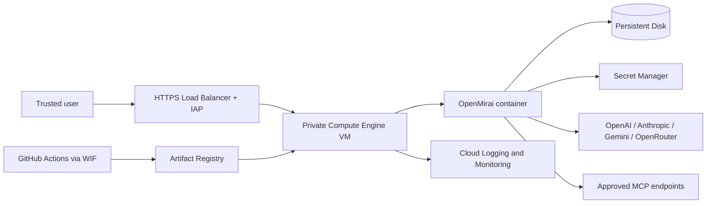
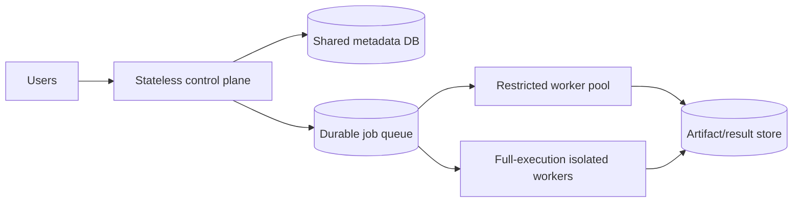

# GCP Cloud Architecture Decision

**Status:** accepted for the first cloud implementation
**Scope:** private, trusted-user deployment of OpenMirai 0.7.x
**Default region:** `us-east1` (South Carolina), with the zone configurable

## Decision

Deploy OpenMirai first as one stateful Linux Compute Engine VM running Docker
Compose. Terminate HTTPS and enforce Google identity before traffic reaches the
VM. Keep OpenMirai's own API key as defense in depth. Store secrets in Secret
Manager, images in Artifact Registry, runtime state on a separately attached
Persistent Disk, and logs/metrics in Cloud Operations.

The initial topology is deliberately single-replica because the current engine
holds graph registrations, agent registrations, execution memory, schedules,
and other coordination state in one process. SQLite is also a local writer.
Adding interchangeable replicas now would produce inconsistent behavior.

## Why `us-east1`

`us-east1` is the default because US regions normally have lower infrastructure
prices than São Paulo and South Carolina is likely to have better routes from
Colombia. This is a planning assumption, not a latency guarantee. Before
production, measure median and p95 HTTPS latency from the actual Colombian
user networks against candidates in `us-east1` and `southamerica-east1`.

Choose `southamerica-east1` instead only when a residency or contractual
requirement outweighs cost and measured latency. The Terraform design must make
the region and zone variables, not constants embedded in modules.

## Initial deployment boundary

| Concern | Decision |
|---|---|
| Runtime | Debian/Ubuntu LTS VM with Docker Engine and Compose v2 |
| Replicas | Exactly one OpenMirai server container |
| Exposure | No direct public VM ingress; HTTPS load balancer and IAP only |
| Users | Trusted internal users in an explicit Google group |
| Authentication | IAP identity plus rotated `MIRAI_API_KEY` |
| State | Zonal Persistent Disk mounted at `/srv/openmirai` |
| Backups | Daily scheduled snapshots; application-consistent SQLite backup |
| Providers | OpenAI API, Anthropic, Gemini, and OpenRouter |
| Execution | Full trusted profile, including shell, filesystem, Git, MCP, browser, and Claude/tmux |
| Availability target | 99.5% monthly |
| Recovery | RPO 24 hours; RTO 4 hours |
| Delivery | GitHub Actions, Workload Identity Federation, Artifact Registry, Terraform |

An ordinary ChatGPT subscription is not an OpenAI API credential. The OpenAI
adapter requires a separately provisioned API key and API billing account.

## Trust boundary

This deployment is a remote-code-execution service for trusted operators. A
caller able to submit an agent can invoke tools that write files, execute shell
commands, perform Git operations, browse external sites, start MCP clients, or
spawn Claude Code sessions. IAP restricts who reaches the API; it does not make
an untrusted agent safe.

The VM must therefore use a dedicated GCP project or tightly isolated VPC,
least-privilege service account, no broad host mounts, no Docker socket inside
the OpenMirai container, and egress controls. Do not serve untrusted tenants
from this deployment shape.

## Scalability decision

Do not scale the VM by adding active replicas. Scale vertically while usage is
small, then introduce a control-plane/worker architecture:

GKE Standard is the preferred later runtime only after the application has a
durable job protocol, shared metadata, leases/idempotency, cancellation, and
isolated worker profiles. Kubernetes does not fix process-local state.

## Rejected alternatives

| Alternative | Reason not selected now |
|---|---|
| Cloud Run | Full profile needs writable durable state, subprocesses, browser dependencies, tmux, and long-lived sessions. |
| Multiple Compute Engine replicas | Registries and memory are process-local; SQLite ownership is not distributed. |
| GKE immediately | Adds orchestration complexity before the engine has distributed-work contracts. |
| Public IP plus API key | One shared key lacks user identity, authorization, and strong perimeter controls. |
| São Paulo by default | Expected higher cost and no demonstrated latency advantage for Colombian users. |

## Revisit triggers

Revisit this decision when any of the following becomes true:

- sustained CPU exceeds 60% or memory exceeds 70% during peak hours;
- concurrent runs cause unacceptable queueing or p95 latency;
- users require independent quotas, data boundaries, or untrusted workloads;
- a 4-hour restore cannot meet the business requirement;
- a single VM cannot meet the availability target;
- the scheduler, registrations, memory, and run state become durable/shared.

## External references

- [Google Cloud locations and Region Picker](https://cloud.google.com/about/locations)
- [Compute Engine regions and zones](https://cloud.google.com/compute/docs/regions-zones)
- [Identity-Aware Proxy documentation](https://cloud.google.com/iap/docs)
- [Workload Identity Federation for deployment pipelines](https://cloud.google.com/iam/docs/workload-identity-federation-with-deployment-pipelines)
