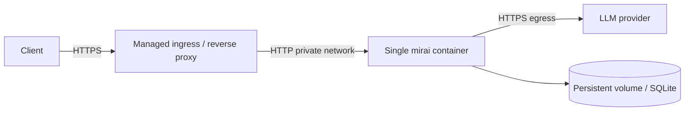
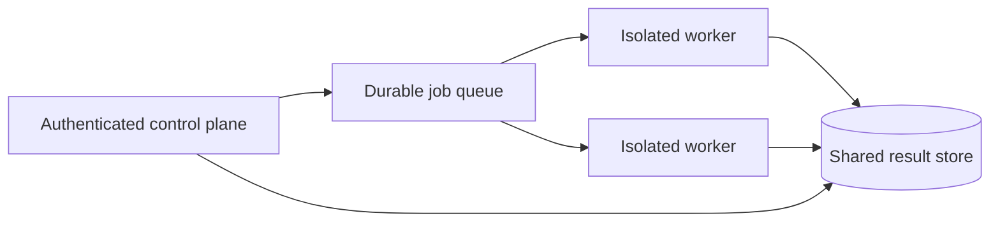

# Cloud Deployment Readiness

This guide translates OpenMirai's current runtime architecture into a safe
container and cloud plan. It is intentionally a readiness guide, not a claim
that the repository already ships a production Docker image.

OpenMirai 0.7.0 can be compiled into a Linux binary and run as a single HTTP
service. Before operating it in the cloud, you must account for its local
SQLite file, process-local registries, host-level tools, outbound model calls,
and optional tmux orchestration.

Read [System Architecture and Execution Lifecycle](../SYSTEM_LIFECYCLE.md)
first. That document explains the runtime whose deployment is described here.

## 1. Current readiness verdict

| Deployment shape | Current assessment |
|---|---|
| Local CLI | Supported. |
| Single HTTP process on one VM | Supported with authentication, durable local disk, and OS isolation. |
| Single container with one replica | Feasible after creating an image and applying the controls in this guide. |
| Single container with tmux/Claude orchestration | Feasible but operationally heavy; requires extra binaries, persistent home state, and long-lived process semantics. |
| Multiple stateless replicas | Not correct today for agent/graph registry, agent memory, scheduling, or SQLite ownership. |
| Horizontally scaled production control plane | Requires shared durable stores, coordination, and separation of unsafe execution workers. |
| Running untrusted agents in the API container | Unsafe without a stronger OS/kernel sandbox and strict capability separation. |

The sensible first milestone is a **single-replica, authenticated API service**
with a persistent volume and no untrusted host-execution tools.

## 2. What the future container must run

The server process is:

```bash
mirai serve \
  --host 0.0.0.0 \
  --port 3000 \
  --db-path /data/openmirai/engine.db
```

Required production environment:

```text
MIRAI_API_KEY=<server authentication secret>
MIRAI_LLM_PROVIDER=<provider>
MIRAI_LLM_MODEL=<model>
<PROVIDER>_API_KEY=<provider credential, when needed>
```

Use provider-specific credentials—`OPENAI_API_KEY`, `ANTHROPIC_API_KEY`,
`GOOGLE_API_KEY`, `GROQ_API_KEY`, `NVIDIA_API_KEY`, or
`OPENROUTER_API_KEY`—instead of passing `--api-key` to `mirai serve`. The
current CLI parses the same `--api-key` value for both provider configuration
and server authentication, while `MIRAI_API_KEY` is explicitly the server key.

For Ollama, configure `OLLAMA_BASE_URL` and ensure the container can reach the
Ollama service. Do not assume `localhost:11434` reaches another container.

## 3. Container image design

The repository has no `Dockerfile` today. A future image should use a
multi-stage build:

```text
Rust builder stage
  -> copy Cargo manifests and source
  -> compile release mirai binary
  -> optionally strip binary

Minimal Linux runtime stage
  -> copy mirai
  -> create non-root user
  -> create /data/openmirai and optional /workspace
  -> expose 3000
  -> healthcheck /health
  -> run mirai serve
```

### 3.1 Runtime base-image trade-off

A distroless image is only suitable for a deliberately restricted engine
profile. The default built-in tool set assumes several host programs may be
available:

| Feature/tool | Runtime dependency |
|---|---|
| `system/bash` | `sh` |
| `system/process_list` | `ps` |
| git tools | `git` |
| `system/sandbox_exec` JavaScript | `node` |
| `system/sandbox_exec` Python | `python` |
| orchestrated sessions | Unix, `tmux`, and authenticated `claude` CLI |
| browser-opening editor behavior | Desktop/browser integration; inappropriate for a headless container |

Choose one of two image strategies:

1. **Restricted API image:** small base, no tmux/Claude, minimal external
   programs, and an allowlisted tool catalog implemented by the host. This is
   the preferred cloud direction.
2. **Full execution image:** includes shell, process tools, git, language
   runtimes, tmux, and possibly Claude Code. It has a much larger attack
   surface and should run as an isolated worker, not the public control plane.

The current binary always registers all built-in tools in CLI/server startup.
Creating the restricted image alone does not remove their API descriptions; it
only makes missing programs fail at runtime. A production restricted profile
should also add explicit tool-family allowlisting in code.

### 3.2 Native library compatibility

Release CI produces `x86_64-unknown-linux-gnu` and
`aarch64-unknown-linux-gnu` binaries. A glibc-compatible runtime image is the
least surprising match. SQLite is compiled with `rusqlite`'s `bundled`
feature, and outbound HTTP uses Rustls, so no external SQLite server or OpenSSL
runtime is required.

Do not describe the binary as universally static without verifying it with
`ldd` for the exact build target.

### 3.3 Build metadata in Docker

The build scripts read Git metadata and optional CI variables. If the Docker
build context excludes `.git`, `MIRAI_GIT_SHA` becomes `unknown`. To retain
traceability, either include the required Git metadata in the builder stage or
extend the build to accept a trusted explicit SHA.

Set `MIRAI_BUILD_NUMBER` and `MIRAI_BUILD_TS` in the builder environment so
`/health` and `/version` identify the artifact.

## 4. Filesystem and volume layout

A practical single-container layout is:

```text
/app/mirai                         immutable binary
/data/openmirai/engine.db          durable run history
/data/openmirai/config.toml        optional persisted user config
/data/openmirai/orchestrator_sessions.json  only if orchestrator enabled
/workspace                         optional agent working directory
/tmp                               ephemeral scratch
```

Set the container user's `HOME` consistently if any component relies on
`~/.openmirai`. Prefer explicit paths for server run persistence:

```bash
--db-path /data/openmirai/engine.db
```

Mount only the directories agents actually need. The filesystem tools can
access every path visible to the process and have no application-level root
jail. A read-only root filesystem does not protect a broadly mounted writable
volume.

### 4.1 What the persistent volume does and does not preserve

The SQLite file preserves final run results. It does not currently restore:

- HTTP-created graph definitions;
- HTTP-created agent specifications;
- agent `persist: execution` KV memory;
- live scheduler registrations or cycle history;
- an in-flight `SharedState`;
- generic checkpoints, because the default host attaches no checkpoint repository.

If a container restarts, clients must re-register graph/agent definitions or a
future bootloader must load them from a real repository.

## 5. Network architecture

Recommended first deployment:



The Axum listener serves HTTP, not HTTPS. Terminate TLS before the container.
Restrict the service to a private network where possible and let only the
ingress reach port 3000.

### 5.1 Authentication

OpenMirai refuses `--host 0.0.0.0` or another non-loopback bind without an API
key. Always set a high-entropy `MIRAI_API_KEY` and send it as `X-API-Key`.

`/health`, `/version`, and static `/ui` are public by design. Decide whether
your ingress should further restrict them or expose only `/health` to the
platform health checker.

The built-in API key is a single shared secret, not user identity, tenancy,
role-based authorization, rotation, quota enforcement, or audit attribution.
Place stronger identity and policy controls at the gateway before supporting
multiple users or tenants.

### 5.2 CORS is not service authorization

The server restricts browser origins and rejects untrusted mutating browser
requests, but non-browser clients can call the API directly. CORS protects
browsers; `MIRAI_API_KEY`, network policy, and an identity-aware gateway protect
the service.

### 5.3 Egress

At minimum, allow egress only to:

- the selected LLM provider;
- Ollama or MCP services explicitly used by agents;
- approved targets for web-scraping tools;
- DNS and required platform endpoints.

Unrestricted egress expands the effect of prompt injection and host command
execution. The default tool set includes direct HTTP behavior outside the
resource-port abstraction.

## 6. Security model for cloud execution

### 6.1 Why the public API is high impact

An authorized caller can register and execute agent graphs. The built-in tools
include shell execution, recursive deletion, filesystem writes, Git commits,
outbound requests, MCP process/network calls, and external session spawning.
Therefore the API is effectively a remote execution control plane.

Treat every agent definition as code, not as passive configuration.

### 6.2 Minimum container hardening

Use all of the following:

- run as a dedicated non-root UID/GID;
- read-only root filesystem;
- explicit, narrow writable mounts;
- no host root, home, Docker socket, cloud metadata socket, or Kubernetes service-account token mounts;
- drop all Linux capabilities, adding none unless proven necessary;
- `no-new-privileges`;
- seccomp/AppArmor/SELinux profile;
- CPU, memory, process, file-descriptor, and ephemeral-storage limits;
- outbound network policy;
- secrets injected by the platform, never baked into the image;
- log redaction and no agent access to the secrets directory;
- separate worker identity with the minimum cloud permissions;
- image signing, digest pinning, and vulnerability scanning.

`system/bash` command filtering and `system/sandbox_exec` are not substitutes
for these controls.

### 6.3 Recommended control-plane/worker split

For production, evolve toward:



The control plane should validate/store specs and expose status. Disposable
workers should execute graphs with a per-job filesystem, scoped secrets,
network policy, and a tool allowlist. This separation is not implemented in
the current repository; it is the target architecture needed for safe
multi-user or untrusted workloads.

## 7. Configuration and secrets

| Setting | Purpose | Production guidance |
|---|---|---|
| `MIRAI_API_KEY` | HTTP server shared secret | Required; store in secret manager and rotate through controlled rollout. |
| `MIRAI_LLM_PROVIDER` | Default provider | Set explicitly; do not rely on a developer's persisted config. |
| `MIRAI_LLM_MODEL` | Default model | Pin explicitly for reproducibility. |
| Provider API key | LLM authentication | Use the provider-specific environment variable. |
| `OLLAMA_BASE_URL` | Ollama endpoint | Use service DNS, not localhost, when Ollama is separate. |
| `MIRAI_DB_PATH` / `--db-path` | Final-run SQLite file | Point to a mounted local persistent volume. |
| `MIRAI_UI_DIR` | Static UI root | Omit unless the image intentionally includes the UI. |
| `MIRAI_PROJECTS_DIRS` | Project roots for orchestrator picker | Avoid in a restricted API deployment. |
| `MIRAI_BENCHMARK*` | Benchmark logging | Disable unless the output location and data sensitivity are controlled. |
| `MIRAI_SCRATCH_DIR` | Tool scratch location | The default server context does not currently wire a scratch dir; add host wiring before relying on it. |

Do not put secrets in an agent YAML file, node config, trigger payload, image
layer, command line visible in process listings, or persisted trace/state.

## 8. Persistence and scaling

### 8.1 SQLite operating model

The server opens one SQLite connection behind a mutex, enables WAL, applies a
10-second busy timeout, and moves blocking DB operations to Tokio's blocking
pool. This is suitable for a single process with moderate final-run writes.

Use a local block volume. SQLite WAL is not a design for multiple OpenMirai
replicas writing a shared network filesystem. Back up the database and test
restore behavior.

### 8.2 Why replicas are not interchangeable

Even with a shared session database, each replica has different in-memory:

- agents and graphs;
- hot sessions;
- agent memory;
- schedules and cycle history;
- pause flags and in-flight runs;
- tmux session manager and activity.

A load balancer can route creation to replica A and execution to replica B,
where the agent does not exist. Sticky sessions reduce symptoms but do not
provide durability or failover.

### 8.3 Requirements before horizontal scaling

Implement or choose:

1. durable graph and `AgentSpec` repositories loaded by every replica;
2. durable agent-memory backend;
3. distributed run queue and ownership/lease model;
4. durable checkpoints and resume API;
5. distributed scheduling with leader election or a managed scheduler;
6. shared result store designed for concurrent access;
7. cancellation, timeout, and idempotency semantics;
8. tenant-aware authorization and resource scoping;
9. central logs, metrics, and traces;
10. isolated execution workers.

Until these exist, run one active server replica per state domain.

## 9. Health, readiness, and observability

### 9.1 `/health`

The public health response reports process uptime, compiled version/build/SHA,
and in-memory counts. It does not currently prove that:

- the configured LLM provider is reachable;
- the configured model exists;
- SQLite is writable;
- the persistent volume has free space;
- tmux/Claude dependencies are healthy;
- an agent can execute successfully.

Use `/health` as a liveness signal. Add a separate readiness check before
routing production traffic. Readiness should be bounded and should not perform
an expensive LLM generation on every probe.

### 9.2 Shutdown

Give the process enough termination grace for Axum's in-flight requests. The
platform should send SIGTERM, stop new traffic, wait, and only then send
SIGKILL.

Long tool calls, the 300-second synchronous execute timeout, and streaming runs
make the grace period a policy decision. The current code does not expose a
durable in-flight job handoff, so forced termination loses active execution
state.

### 9.3 Logs and traces

The runner produces trace and transcript objects, and final HTTP runs persist
them. The `/otel-trace` endpoint generates an OpenTelemetry-compatible view of
a stored run, but the service does not by itself export a full production
telemetry pipeline.

Before cloud launch, add:

- structured stdout logging with request/session correlation;
- metrics for request rate, duration, errors, timeouts, retries, node/tool use, provider latency, DB failures, and queue depth;
- centralized traces;
- secret and payload redaction;
- alerting on persistence fallback, auth failures, resource saturation, and repeated tool errors.

## 10. Deployment modes

### 10.1 Recommended learning deployment

- one container;
- one replica;
- authenticated ingress;
- one persistent block volume;
- cloud LLM provider;
- no orchestrator endpoints in use;
- only trusted agent specs;
- minimal workspace mount;
- strict CPU/memory/egress limits.

This is the right environment for understanding real behavior without solving
distributed systems first.

### 10.2 Ollama deployment

Run Ollama as a separate service with its own model volume and resource limits.
Point OpenMirai at its service URL. Co-locating both in one container makes
resource scheduling, health checks, upgrades, and image size harder.

### 10.3 Orchestrator deployment

The tmux/Claude session manager expects a long-lived Unix host with mutable
home state and project directories. It is a poor fit for autoscaled stateless
containers. If needed, deploy it as a dedicated, single-replica worker with:

- `tmux` and Claude Code installed;
- provider/user authentication prepared;
- persistent `HOME/.openmirai`;
- explicit project volume mounts;
- no public network exposure except through the authenticated control plane;
- aggressive isolation because it can run coding agents with broad permissions.

## 11. Failure-mode table

| Failure | Current behavior | Cloud implication |
|---|---|---|
| SQLite open fails | Server starts and logs persistence disabled | Readiness must detect this if durability is required. |
| SQLite save fails | Request still succeeds; hot cache retains result | Alert on warnings; client success does not guarantee durable write. |
| Provider unavailable | Individual tool/run fails; CLI preflight is stronger than server startup | Add provider readiness and retry policy. |
| Synchronous run exceeds 300s | HTTP 504; handler does not record a final run | Client needs idempotency strategy; active future is cancelled by timeout. |
| Streaming client disconnects | Delivery task stops; execution task may continue | Add explicit cancellation/accounting before billing-sensitive production use. |
| Process terminates mid-run | In-flight state is lost | Durable job/checkpoint architecture required for recovery. |
| Process restarts | Registered agents/graphs and agent memory disappear | Re-registration/bootstrap required. |
| Two replicas receive related calls | State diverges | Do not scale horizontally yet. |
| Non-loopback bind without key | Startup fails | Correct secure default; configure secret before deployment. |
| Unsafe tool succeeds | Runs with container OS permissions | Container is part of the sandbox; limit mounts, identity, capabilities, and egress. |

## 12. Pre-Docker implementation checklist

Before adding the repository's first Dockerfile, decide:

- [ ] Is the image a restricted API image or a full execution worker?
- [ ] Which built-in tools are allowed in that profile?
- [ ] Which Linux programs must exist in the runtime image?
- [ ] Which UID/GID owns `/data/openmirai` and `/workspace`?
- [ ] What is the exact persistent-volume path and backup plan?
- [ ] Which provider/model and egress destinations are permitted?
- [ ] Where does TLS terminate?
- [ ] How is `MIRAI_API_KEY` created and rotated?
- [ ] What is liveness versus readiness?
- [ ] What termination grace period is acceptable?
- [ ] Are agent specs trusted?
- [ ] Are orchestrator endpoints included or intentionally unsupported?
- [ ] How are logs and traces redacted and exported?
- [ ] Is the service intentionally single-replica?

## 13. Future Docker acceptance tests

A Docker implementation should not be considered complete until CI verifies:

1. image builds reproducibly for the supported architecture;
2. container runs as non-root;
3. root filesystem is read-only except declared mounts;
4. non-loopback startup without `MIRAI_API_KEY` fails;
5. authenticated `/health` policy and public health behavior match the design;
6. a trusted example agent executes through HTTP;
7. the run appears in SQLite;
8. run history survives container restart with the same volume;
9. graph/agent re-registration behavior is documented and tested;
10. SIGTERM produces graceful server shutdown;
11. CPU, memory, PID, and file limits are enforced;
12. forbidden filesystem/network destinations are unreachable;
13. secrets are absent from the image history and normal logs;
14. dependency and image vulnerability scans pass policy;
15. the SBOM and image digest are published with the release.

## 14. Recommended deployment roadmap

### Phase 1 — Understand and reproduce

Build locally, run example YAML through CLI, then run one authenticated HTTP
server and inspect state, trace, transcript, SQLite, and restart behavior.

### Phase 2 — Single hardened container

Add a multi-stage image, non-root runtime, volume, health checks, secret
injection, and strict network/filesystem limits. Keep one replica and trusted
agents.

### Phase 3 — Restricted production profile

Add tool allowlisting, tenant-aware auth, durable agent/spec storage,
readiness, central telemetry, and explicit cancellation/idempotency.

### Phase 4 — Isolated workers

Separate public control plane from graph execution. Send jobs to disposable,
least-privileged workers and persist checkpoints/results centrally.

### Phase 5 — Horizontal scale

Only after state, scheduling, ownership, and recovery are externalized should
the control plane and workers scale independently.

## 15. Related references

- [System lifecycle](../SYSTEM_LIFECYCLE.md)
- [Accepted GCP architecture](CLOUD-ARCHITECTURE-DECISION.md)
- [GCP implementation plan](CLOUD-IMPLEMENTATION-PLAN.md)
- [Container runtime contract](CONTAINER-RUNTIME-CONTRACT.md)
- [Execution security profiles](EXECUTION-SECURITY-PROFILES.md)
- [State, bootstrap, and recovery](STATE-BOOTSTRAP-RECOVERY.md)
- [Cloud acceptance tests](CLOUD-ACCEPTANCE-TESTS.md)
- [Infrastructure and releases](INFRA.md)
- [Architecture](../ARCHITECTURE.md)
- [Built-in tool security boundaries](../backend/BUILTIN_TOOLS.md)
- [HTTP API](../backend/API.md)
- [Database schema](../database/SCHEMA.md)
- [Memory](../backend/MEMORY.md)
- [Current gaps](../GAPS.md)
