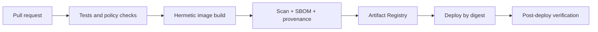

# Release and Software Supply-Chain Contract

The cloud deployment must be reproducible from a reviewed commit and must not
depend on mutable tags, developer workstations, or long-lived GCP keys.

## Artifact flow

## CI gates

Retain the repository's Rust formatting, Clippy, test, HTTP, CLI, and SDK gates.
Add:

- Docker build and container smoke tests;
- dependency and container vulnerability scanning;
- secret scanning;
- SBOM generation;
- Terraform format, validate, lint, policy, and plan review;
- Compose schema validation;
- boot-manifest/AgentSpec validation;
- documentation link checks;
- acceptance tests appropriate to the environment.

High or critical exploitable vulnerabilities block promotion unless a named
security owner documents a time-bounded exception.

## Build identity

GitHub Actions authenticates to GCP with Workload Identity Federation using
repository, branch/tag, workflow, and environment conditions. Use separate
service accounts for image publishing and production deployment. Neither gets
project Owner/Editor.

Do not store service-account JSON keys, provider keys, or runtime secrets in
GitHub. Build jobs do not receive runtime LLM credentials.

## Image requirements

- multi-stage build with pinned base image digest;
- Rust dependencies locked by `Cargo.lock`;
- runtime package versions pinned where practical;
- non-root runtime and no build tools not required by the selected profile;
- build metadata includes OpenMirai version, commit SHA, and timestamp;
- OCI labels record source and revision;
- SBOM and provenance attached to the image/release;
- immutable digest used by Compose/Terraform.

Tag images for human navigation (`vX.Y.Z`, commit SHA), but deploy only the
resolved `sha256:` digest.

## Promotion

Build once. Promote the same digest from non-production to production after
tests and approval. Do not rebuild for production. Store an environment release
record with:

- Git commit and tag;
- image digest and SBOM/provenance references;
- Terraform commit and plan;
- boot-manifest revision;
- backup ID;
- deployer/approver identities;
- smoke-test and acceptance results.

## Deployment

The deployment workflow:

1. verifies the digest, attestations, and approval;
2. checks current health and creates a consistent pre-deploy backup;
3. renders Compose configuration without printing secrets;
4. pulls the digest and performs controlled replacement;
5. waits for boot and authenticated readiness;
6. runs smoke tests;
7. records the release or automatically rolls back on failure.

Because production is single-instance, announce and measure a maintenance
window until blue/green state handling exists.

## Rollback

Retain at least the previous known-good digest and compatible boot manifest.
Application rollback is safe only if persistent schema/data remain backward
compatible. Every migration needs an explicit forward and rollback/restore
plan. When compatibility is uncertain, restore the pre-deploy backup into a
new disk/VM rather than starting old code against new state.

## Provenance verification at runtime

On startup, log the compiled version, commit SHA, image digest when available,
configuration revision, and boot-manifest revision. `/version` and `/health`
must agree with the release record. Alert on unknown SHA or mutable/unrecorded
image references.

## External references

- [Google Cloud Artifact Registry](https://cloud.google.com/artifact-registry/docs)
- [Workload Identity Federation for deployment pipelines](https://cloud.google.com/iam/docs/workload-identity-federation-with-deployment-pipelines)
- [SLSA framework](https://slsa.dev/)
