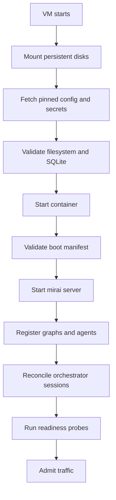

# State, Bootstrap, and Recovery Contract

This document states what survives a restart and how the service reconstructs
usable state. It closes the gap between "SQLite is persistent" and "the system
recovers completely."

## State inventory

| State | Current owner | Durable now | Recovery source |
|---|---|---:|---|
| completed server runs | SQLite | yes | restored database |
| graph registrations created through HTTP | process memory | no | versioned boot manifest or client replay |
| agent registrations created through HTTP | process memory | no | versioned boot manifest or client replay |
| execution `SharedState` in flight | process memory | no | rerun; generic checkpoints are not host-wired |
| agent `persist: execution` memory | process memory | no | unavailable after restart |
| scheduler registrations/history | process memory | no | boot manifest; scheduler is not started by current `serve()` |
| orchestrator registry | local JSON/state | partial | persisted orchestrator home/registry plus tmux reconciliation |
| tmux/Claude processes | host process/session | partial | reconcile, never assume registry equals reality |
| workspaces/Git clones | filesystem | if mounted | persistent workspace volume or recreate from Git |
| provider/API credentials | Secret Manager | yes | fetch enabled versions at startup |
| image/config | registry/Git | yes | deploy pinned digest and revision |

## Canonical sources

- Git is the source of truth for boot AgentSpecs, GraphSpecs, non-secret config,
  and approved MCP definitions.
- Artifact Registry is the source of truth for immutable images.
- Secret Manager is the source of truth for credentials.
- SQLite is the source of truth only for the run records it actually stores.
- Persistent workspace data is not configuration; back it up or make it
  reproducible from Git/object storage.

## Boot manifest

The future deployment must define a versioned manifest containing:

```yaml
version: 1
agents:
  - path: agents/example.yaml
    expected_id: example
mcp_servers:
  - path: deploy/mcp/approved.yaml
startup_policy:
  duplicate_id: fail
  invalid_definition: fail
  registration_timeout_seconds: 60
```

No secret values belong in this manifest. Each file must pass the same parser
and validation used by normal registration.

## Startup sequence



If any mandatory definition fails, readiness remains false and traffic must not
be admitted. Boot must be idempotent: replaying the same version either
converges to the same definitions or fails with a clear conflict; it must never
silently create different IDs.

## Backup procedure

Daily disk snapshots satisfy only the default 24-hour RPO. In addition, create
an application-consistent SQLite backup before every deployment and on a daily
schedule:

1. stop admission of new runs;
2. wait for active runs or reach the documented timeout;
3. use SQLite's online backup mechanism or `VACUUM INTO`, not a blind file copy
   of an active database;
4. verify `PRAGMA integrity_check` on the backup;
5. record application version, schema version, time, and checksum;
6. copy the backup to a versioned, access-controlled Cloud Storage location;
7. resume admission and alert on any failed step.

Back up workspace and orchestrator state separately according to their value.
Do not back up disposable browser caches or temporary files.

## Restore procedure

1. declare the incident and stop writers;
2. select the newest verified backup within the RPO;
3. provision a clean VM from Terraform and the last known-good image digest;
4. attach a new data disk; never overwrite the only forensic copy;
5. restore SQLite and verify integrity;
6. restore approved workspace/orchestrator data if required;
7. load the exact boot-manifest revision compatible with the image;
8. start privately and run the full recovery smoke tests;
9. switch traffic only after sign-off;
10. record actual RPO/RTO and preserve incident evidence.

Target completion is four hours. Rehearse quarterly and after material storage
or deployment changes.

## Recovery semantics

- completed runs present in the restored backup remain queryable;
- in-flight runs at failure are not recoverable today and must be marked or
  treated as interrupted;
- client-submitted registrations not represented in the boot manifest are lost;
- agent execution memory is lost on process restart;
- Git workspaces may be recreated only if all required commits were pushed;
- external provider side effects may already have happened even when a run
  record is missing, so retries require operator judgment or idempotency keys.

## Validation evidence

Every backup job records checksum, integrity result, object generation, source
image version, and duration. Every quarterly restore records selected backup,
fresh resource IDs, test results, observed RPO/RTO, and corrective actions.
