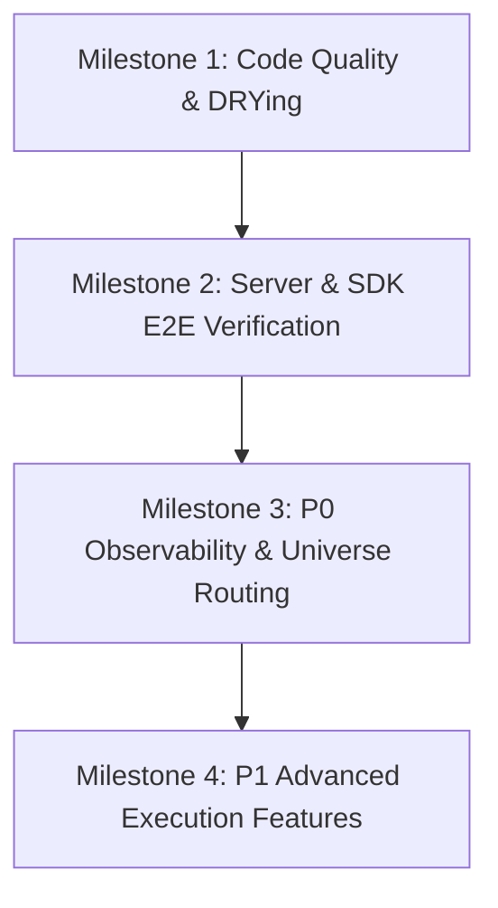

# PLAN_000: OpenMirai Development Path & Architectural Improvements

This document outlines the architectural assessment, E2E testing audit, pending features, and a structured milestone path to improve the OpenMirai ecosystem.

---

## 1. Architectural & Design Pattern Audit

OpenMirai has a solid foundation based on Hexagonal Architecture (Ports and Adapters), Strategy patterns for LLMs and tools, and Mementos for checkpoints. However, as the codebase scales, we recommend addressing the following architectural issues:

### A. Repetitive Macros (Violation of DRY)
* **Finding**: The macro block definitions (e.g. `logic_tool!`, `ai_tool!`, `data_tool!`) are duplicated across different module source files (like `logic.rs`, `ai.rs`, and `data/mod.rs`).
* **Critique**: If the internal layout of `ToolSpec` or `ToolField` changes, all files must be updated. This introduces high risk and code churn.
* **Recommendation**: Centralize tool declaration macros in a dedicated module (e.g. `engine/src/tools/macros.rs`) and re-export them globally for use in all submodules.

### B. Concurrent State Mutability (SharedState)
* **Finding**: `SharedState` holds executing state in thread-safe wrappers, but there is no transactional locking mechanism.
* **Critique**: During a fan-out execution where multiple Tokio threads run different branches in parallel, writing to the same keys in `SharedState` creates race conditions, violating determinism.
* **Recommendation**: Introduce transactional locking or fork-join state merging:
  1. Fork the `SharedState` for each parallel node execution.
  2. Implement a merge strategy inside `logic/fan_in` or `GraphRunner` to consolidate branching states explicitly.

### C. Manual Dependency Injection (Context Wiring)
* **Finding**: Adapters are manually wired and instantiated directly inside the CLI (`cli/src/main.rs`) and the Axum HTTP server (`server/mod.rs`).
* **Critique**: Highly coupled setup makes it difficult to run integrations with different resource sets without rewriting setup logic.
* **Recommendation**: Implement a Factory or Builder pattern to resolve execution environments dynamically based on configuration profiles (e.g. `ContextFactory::build(profile_spec)`).

---

## 2. End-to-End (E2E) Testing Audit

While OpenMirai has a thorough unit and in-process integration test suite (712 tests), its E2E coverage contains several severe gaps:

### A. Gaps Found
1. **No Real HTTP Server E2E Tests**:
   - The Axum endpoints are tested in-process using `tower::ServiceExt` inside `server/tests.rs` with mock/in-memory adapters.
   - There are no tests that spin up the actual compiled `mirai serve` binary, launch a background server process, and interact with it over TCP port loops.
2. **Zero Client SDK Testing**:
   - Both the Python SDK (`sdks/python/`) and TypeScript SDK (`sdks/typescript/`) have **zero** tests. They are completely unvalidated in the codebase.
3. **No Key-Gated Live Provider Testing**:
   - All tests use the `MockLLMResource`.
   - Real LLM providers (Claude, OpenAI, Gemini) are never verified automatically, leaving integration code vulnerable to upstream API changes or prompt-formatting regressions.

### B. Recommendations
* **Build a Server E2E suite**: Create a shell or integration script in `test/e2e_server.sh` that builds the binary, runs `mirai serve` on a random port, triggers mock agents via curl, and asserts the HTTP response formats and SSE streams.
* **Introduce SDK Tests**: Add basic `pytest` for the Python SDK and `vitest`/`jest` for the TypeScript SDK. Execute them automatically in the CI pipeline against a running local mock server.
* **Live Integration Smoke Tests**: Implement key-gated tests (e.g., `#[cfg(feature = "live-tests")]`) that run when API keys are available in the env, ensuring that provider request/response formats remain compliant with Anthropic, OpenAI, and Gemini.

---

## 3. Pending Roadmap (GAPs)

Based on `docs/GAPS.md` and `docs/ROADMAP-PARITY.md`, the priority backlog for achieving competitiveness with LangGraph is structured below:

| Feature ID | Category | Description | Priority | Esfuerzo |
|---|---|---|---|---|
| **GAP-003** | Observability | Visual Tracing & OpenTelemetry formatting for debugging sessions | **P0** | High |
| **GAP-F** | Universe | Multi-agent runtime execution with internal A2A queues | **P0** | Medium |
| **GAP-004** | Parallelism | Dynamic Fan-out / Fan-in (spawning parallel tokio workers at runtime) | **P1** | Medium |
| **GAP-005** | Memory | Cross-thread semantic memory search via vector stores | **P1** | Medium |
| **GAP-H** | RAG | Real Embeddings (`context.llm().embed()`) and cosine-similarity search | **P1** | Medium |
| **GAP-006** | Composition | Subgraphs with namespace-isolated checkpoints and mapping | **P1** | Medium |
| **GAP-G** | Evaluation | Integrated LLM-as-judge relevance and formatting metrics | **P2** | Medium |
| **GAP-007** | Middleware | Granular hooks for prompt compilation and node routing jumps | **P2** | Medium |

---

## 4. Development Path (Milestones)

### Milestone 1: Code Quality & DRYing [COMPLETED]
1. **Centralize macros**: Move `logic_tool!`, `ai_tool!`, and `data_tool!` into `engine/src/tools/macros.rs` and refactor existing modules. (Done)
2. **State fork-join**: Implement state replication and conflict resolution strategies for parallel branching paths. (Done)

### Milestone 2: Server & SDK E2E Verification [COMPLETED]
1. **HTTP E2E Script**: Create `test/e2e_server.sh` to test the serve command, validating SSE connection streams. (Done)
2. **Python & TypeScript SDK Tests**: Add tests inside `sdks/python` and `sdks/typescript` that boot a temporary server instance to execute client calls. (Done)
3. **API CI integration**: Configure the GitHub Actions workflow to run the E2E verification steps automatically. (Done)

### Milestone 3: Stability & Production Resilience [COMPLETED]
1. **Tool Field Validator macro**: In tools/macros.rs, implement structural configuration field validations (min/max size, numeric bounds, format constraints). (Done)
2. **Structured logging instrumentation**: Add semantic structured telemetry (`tracing`) to adapters (db, llm, vector). (Done)

### Milestone 4: P0 Observability & Universe Routing (Target: 2 weeks)
1. **Visual Session Tracer**: Implement a trace endpoint matching OpenTelemetry schemas, enabling downstream UIs to render flow visualization.
2. **Universe A2A queues**: Build thread-safe internal queue systems allowing agents in the universe to send/receive messages asynchronously.
3. **GroupChat Execution**: Implement LLM-orchestrated agent debates.

### Milestone 5: P1 Advanced Execution (Target: 3 weeks)
1. **Dynamic Fan-out**: Build the `logic/fan_out` and `logic/fan_in` nodes supporting runtime parallelism over collections.
2. **Semantic Vector Memory**: Complete GAP-H (real embeddings) and connect vector stores to agent cross-session memory namespaces (GAP-005).
